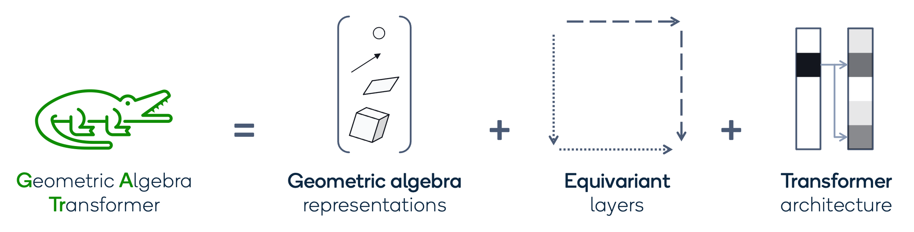

# Geometric Algebra Transformers

This repository contains the official implementation of the
[**Geometric Algebra Transformer**](https://arxiv.org/abs/2305.18415) by
[Johann Brehmer](mailto:jbrehmer@qti.qualcomm.com), Pim de Haan, Sönke Behrends, and Taco Cohen,
published at NeurIPS 2023.



## 1. Abstract

Problems involving geometric data arise in physics, chemistry, robotics, computer vision, and many
other fields. Such data can take numerous forms, such as points, direction vectors, translations, or
rotations, but to date there is no single architecture that can be applied to such a wide variety of
geometric types while respecting their symmetries. In this paper we introduce the Geometric Algebra
Transformer (GATr), a general-purpose architecture for geometric data. GATr represents inputs,
outputs, and hidden states in the projective geometric (or Clifford) algebra, which offers an
efficient 16-dimensional vector-space representation of common geometric objects as well as
operators acting on them. GATr is equivariant with respect to E(3), the symmetry group of 3D
Euclidean space. As a Transformer, GATr is versatile, efficient, and scalable. We demonstrate GATr
in problems from n-body modeling to wall-shear-stress estimation on large arterial meshes to robotic
motion planning. GATr consistently outperforms both non-geometric and equivariant baselines in terms
of error, data efficiency, and scalability.

## 2. Getting started

Clone the repository.

```bash
git clone https://github.com/Qualcomm-AI-research/geometric-algebra-transformer
```

Build the Docker image from inside the checked-out repository. On Linux, this can be done using

```bash
cd geometric-algebra-transformer
docker build -f docker/Dockerfile --tag gatr:latest .
```

The commands for Windows are similar.

Once the image has built successfully, we can run a container that is based on it.

On Linux, the command that does this and also

- mounts the current working directory into the container
- changes to the current working directory
- exposes all of the host's GPUs in the container

is

```bash
docker run --rm -it -v $PWD:$PWD -w $PWD --gpus=all gatr:latest /bin/bash
```

## 3. Running experiments

In this repository, we include two experiments: one on a synthetic n-body modeling problem and one
on predicting the wall shear stress on artery walls.

Running experiments will require the specification of directories for datasets, checkpoints, and
logs. We will define a common base directory (feel free to adapt):

```bash
BASEDIR=/tmp/gatr-experiments
```

### n-body modeling

First, we need to generate training and evaluation datasets:

```bash
python scripts/generate_nbody_dataset.py base_dir="${BASEDIR}" seed=42
```

Let's train a GATr model, using just 1000 (or 1%) training trajectories and training for 5000 steps:

```bash
python scripts/nbody_experiment.py base_dir="${BASEDIR}" seed=42 model=gatr_nbody data.subsample=0.01 training.steps=5000 run_name=gatr
```

At the end of the training, evaluation metrics are printed to stdout
and written to `$BASEDIR/experiments/nbody/gatr/metrics`. Training and evaluation are also
tracked with MLflow to an SQLite database at `$BASEDIR/tracking/mlflow.db`.
MLFlow is configured in the `mlflow` section of `config/nbody.yaml`.

We can repeat the same for different baselines, for instance:

```bash
for METHOD in mlp transformer gcagnn se3transformer segnn
do
  python scripts/nbody_experiment.py base_dir="${BASEDIR}" seed=42 model=${METHOD}_nbody data.subsample=0.01 training.steps=5000 run_name=$METHOD
done
```

On the `eval` set (without domain shift), you should get results like these:

```text
         Method |    MSE
----------------+--------
           GATr | 0.0005
----------------+--------
            MLP | 0.0776
    Transformer | 0.0050
        GCA-GNN | 0.0526
SE3-Transformer | 0.0025
          SEGNN | 0.0006
```

Note that the code is
[not fully deterministic](https://pytorch.org/docs/stable/notes/randomness.html), so you will not
get these exact numbers. (After averaging over multiple seeds, such fluctuations should be
negligible).

You can also vary the number of training samples seen (`data.subsample`), the number of optimizer
steps (`training.steps`), the random seed (`seed`), and many other settings. Have a look at
[the n-body config](config/nbody.yaml) and [the GATr model config](config/model/gatr_nbody.yaml).

If you train for long enough and average results from multiple random seeds, you should get numbers
that are comparable to Fig. 2 in our paper. However, do not expect exact reproducibility: the paper
experiments were performed with an earlier version of GATr than the one published in this
repository. In addition, there is stochasticity both in the dataset generation and in the
initialization and training of the networks.

### Arterial wall-shear-stress estimation

The arterial wall-shear-stress experiment uses a dataset created by
[Julian Suk et al](https://arxiv.org/abs/2212.05023).

First, you need to download that dataset following
[the instructions in their repo](https://github.com/sukjulian/coronary-mesh-convolution#data).
We only need the single (not bifurcating) dataset. Store this dataset at some location
`$ARTERYDIR/raw/database.hdf5` and set the environment variable `$ARTERYDIR` correspondingly
(as we will use it in the commands below).

To train a GATr model on a non-canonicalized version of this dataset for 20k steps, run:

```shell
python scripts/artery_experiment.py base_dir="${BASEDIR}" data.data_dir="${ARTERYDIR}" seed=42 training.lr_decay=0.1 training.steps=50000 model=gatr_arteries run_name=gatr
```

To train a Transformer baseline, run:

```shell
python scripts/artery_experiment.py base_dir="${BASEDIR}" data.data_dir="${ARTERYDIR}" seed=42 training.lr_decay=0.1 training.steps=50000 model=transformer_arteries run_name=transformer_arteries
```

Eventually you should find results like these:

```text
      Method | Approximation error
-------------+---------------------
        GATr |               0.089
 Transformer |               0.105
```

If you run for long enough, you should get results comparable to Fig. 3 and Tbl. 2 in our paper.
Similar to the nbody experiment, results are also tracked with MLFlow.
Again, there is no guarantee for exact reproducibility due to code changes and stochasticity.

## 4. Using GATr

To use GATr on your own problem, you will at least need two components from this repository:
GATr networks, which act on multivector data, and interface functions that embed various geometric
objects into this multivector representations.

Here is an example code snippet that illustrates the recipe:

```python
from gatr import GATr, SelfAttentionConfig, MLPConfig
from gatr.interface import embed_point, extract_scalar
import torch


class ExampleWrapper(torch.nn.Module):
    """Example wrapper around a GATr model.
    
    Expects input data that consists of a point cloud: one 3D point for each item in the data.
    Returns outputs that consists of one scalar number for the whole dataset.
    
    Parameters
    ----------
    blocks : int
        Number of transformer blocks
    hidden_mv_channels : int
        Number of hidden multivector channels
    hidden_s_channels : int
        Number of hidden scalar channels
    """

    def __init__(self, blocks=20, hidden_mv_channels=16, hidden_s_channels=32):
        super().__init__()
        self.gatr = GATr(
            in_mv_channels=1,
            out_mv_channels=1,
            hidden_mv_channels=hidden_mv_channels,
            in_s_channels=None,
            out_s_channels=None,
            hidden_s_channels=hidden_s_channels,
            num_blocks=blocks,
            attention=SelfAttentionConfig(),  # Use default parameters for attention
            mlp=MLPConfig(),  # Use default parameters for MLP
        )
        
    def forward(self, inputs):
        """Forward pass.
        
        Parameters
        ----------
        inputs : torch.Tensor with shape (*batch_dimensions, num_points, 3)
            Point cloud input data
        
        Returns
        -------
        outputs : torch.Tensor with shape (*batch_dimensions, 1)
            Model prediction: a single scalar for the whole point cloud.
        """
        
        # Embed point cloud in PGA
        embedded_inputs = embed_point(inputs).unsqueeze(-2)  # (..., num_points, 1, 16)
        
        # Pass data through GATr
        embedded_outputs, _ = self.gatr(embedded_inputs, scalars=None)  # (..., num_points, 1, 16)
        
        # Extract scalar and aggregate outputs from point cloud
        nodewise_outputs = extract_scalar(embedded_outputs)  # (..., num_points, 1, 1)
        outputs = torch.mean(nodewise_outputs, dim=(-3, -2))  # (..., 1)
        
        return outputs
```

In the following, we will go into more detail on the conventions used in this code base and the
structure of the repository.

### Design choices

**Representations**: GATr operates with two kind of representations: geometric algebra multivectors
and auxiliary scalar representations. Both are simply represented as `torch.Tensor` instances.

The multivectors are based on the projective geometric algebra G(3, 0, 1). They are tensors of the
shape `(..., 16)`, for instance `(batchsize, items, channels, 16)`. The sixteen multivector
components are sorted as in the
[`clifford` library](https://clifford.readthedocs.io/en/latest/), as follows:
`[x_scalars, x_0, x_1, x_2, x_3, x_01, x_02, x_03, x_12, x_13, x_23, x_012, x_013, x_023, x_123,
x_0123]`.

Scalar representations have free shapes, but should match the multivector representations they
accompany in batchsize and number of items. The number of channels may be different.

**Interface to the real world**: To map the multivector representations to physical objects, we
use the plane-based convention presented in
[Roelfs and De Keninck, "Graded symmetry groups: Plane and simple"](https://arxiv.org/abs/2107.03771).
3D points are thus represented as trivectors, planes as vectors, and so on. We provide these
these interface functions in the `gatr.interface` submodule.

**Functions**: We distinguish between primitives (functions) and layers (often stateful
`torch.nn.Module` instances). Almost all primitives and layers are Pin(3, 0, 1)-equivariant,
see docstrings for exceptions.

### Repository structure

```text
geometric-algebra-transformer
|
└───config: configuration YAML files for the experiments
|   └───model: model configurations
|   |   arteries.yaml: default configuration for the artery experiment
|   |   hydra.yaml: hydra configuration (imported by the experiment configs)
|   |   nbody.yaml: default configuration for the n-body experiment
|
└───docker: Docker environment
|   └───ext_packages: patches for external dependencies
|   |   Dockerfile: Docker container specification
|   |   requirements.txt: external dependencies installed in Dockerfile
|
└───gatr: core library
|   └───baselines: baseline layers and architectures
|   |   |   gcan.py: GCA-MLP and GCA-GNN baselines
|   |   |   mlp.py: MLP baseline
|   |   |   segnn.py: SEGNN baseline
|   |   |   transformer.py: Transformer baseline
|   |
|   └───experiments: experiment managers
|   |   └───arteries: experiment manager, wrappers, etc for the artery experiment
|   |   └───nbody: experiment manager, wrappers, etc for the n-body experiment
|   |   |   base_experiment.py: base class for experiment managers
|   |   |   base_wrapper.py: base class for experiment-specific GATr wrappers
|   |
|   └───interface: embedding of geometric quantities into projective geometric algebra
|   |   |   object.py: 3D objects consisting of positions and orientations
|   |   |   plane.py: planes
|   |   |   point.py: points
|   |   |   pseudoscalar.py: pseudoscalars
|   |   |   ray.py: embedding and extraction of rays
|   |   |   reflection.py: planar reflections
|   |   |   rotation.py: rotations
|   |   |   scalar.py: scalars
|   |   |   translation.py: translations
|   |
|   └───layers: network layers
|   |   └───attention: self-attention layer, its components, and the corresponding configuration
|   |   └───mlp: geometric MLP, its components, and the corresponding configuration
|   |   |   dropout.py: multivector dropout
|   |   |   gatr_block.py: GATr transformer block, the main layer that GATr networks consist of
|   |   |   layer_norm.py: geometric LayerNorm
|   |   |   linear.py: equivariant linear layer between multivectors
|   |
|   └───nets: complete network architectures
|   |   |   axial_gatr.py: axial-attention version of GATr for two token dimensions
|   |   |   gatr.py: GATr architecture for a single token dimension
|   |
|   └───primitives: core functional building blocks of GATr
|   |   └───data: pre-computed basis stored in `.pt` files
|   |   |   attention.py: geometric attention mechanism
|   |   |   bilinear.py: bilinear equivariant functions like the geometric product
|   |   |   dropout.py: geometric dropout
|   |   |   dual.py: dual-related functions like the equivariant join
|   |   |   invariants.py: invariant functions of multivectors like the norm
|   |   |   linear.py: equivariant linear maps between multivectors
|   |   |   nonlinearities.py: gated nonlinearities
|   |   |   normalization.py: geometric normalization functions
|   |
|   └───utils: utility functions
|       |   clifford.py: non-differentiable GA functions based on the clifford library
|       |   compile_linear.py: fast inference via compiled linear layers
|       |   einsum.py: optimized einsum function
|       |   logger.py: logger
|       |   misc.py: various utility functions
|       |   mlflow.py: logging with MLflow
|       |   plotting.py: plotting defaults
|       |   quaternions.py: quaternion operations
|       |   tensors.py: various tensor operations
|       |   warning.py: warnings
|
└───img: images
|
└───scripts: entrypoints to run experiments
|   |   artery_experiment.py: artery experiment script
|   |   generate_nbody_dataset.py: data generation script for the n-body experiment
|   |   nbody_experiment.py: n-body experiment script
│
└───tests: unit tests (e.g. for self-consistency and Pin equivariance)
|   └───gatr
|   |   └───baselines: unit tests for gatr.baselines
|   |   └───interface: unit tests for gatr.interface
|   |   └───layers: unit tests for gatr.layers
|   |   └───nets: unit tests for gatr.nets
|   |   └───primitives: unit tests for gatr.primitives
|   |   └───utils: unit tests for gatr.utils
|   |
|   └───helpers: utility functions for unit tests
|       |   constants.py: test settings (like tolerances)
|       |   equivariance.py: helper functions to test Pin equivariance
|       |   geometric_algebra.py: helper functions to test GA functionality
│
└───tests_regression: regression tests (training a GATr to predict the distance between points)
│  
|   .coveragerc: coverage configuration
|   .dockerignore: Docker configuration
|   .gitignore: git configuration
│   .pylintrc: pylint configuration
│   CHANGELOG.md: changelog
│   LICENSE: license under which this code may be used
│   pyproject.toml: project settings
│   README.md: this README file
│   setup.py: installation script
```

### Support for `torch.compile`

From v1.3.0 onwards, GATr supports compilation using `torch.compile`. However, be aware that **compilation is
experimental and may yield errors or warnings based on your hardware, model, data, and torch
version**, and we will not be able to offer support for compilation errors.
If you choose to use compilation, start with
`torch.compile(model, dynamic=True, fullgraph=False)`. Compilation fails with our caching mechanism
for `torch.einsum` (failure observed for `torch==2.2.1`), so the caching mechanism should be
disabled by calling `gatr.utils.einsum.enable_cached_einsum(False)`.

## 5. Other geometric algebras

The GATr paper and this repository use the projective geometric algebra. In the work
[Euclidean, Projective, Conformal: Choosing a Geometric Algebra for Equivariant Transformers](https://arxiv.org/abs/2311.04744),
we explored using the Euclidean and conformal algebras instead. We found a nuanced trade-off
between the different algebras for their use in GATr. At the moment, the code for the different
algebras has not been released.

## 6. Citation

If you find our code useful, please cite:

```text
@inproceedings{brehmer2023geometric,
  title = {Geometric Algebra Transformer},
  author = {Brehmer, Johann and de Haan, Pim and Behrends, S{\"o}nke and Cohen, Taco},
  booktitle = {Advances in Neural Information Processing Systems},
  year = {2023},
  volume = {37},
  eprint = {2305.18415},
  url = {https://arxiv.org/abs/2305.18415},
}

@inproceedings{dehaan2023euclidean,
  title = {Euclidean, Projective, Conformal: Choosing a Geometric Algebra for Equivariant Transformers}, 
  author = {Pim de Haan and Taco Cohen and Johann Brehmer},
  booktitle = {Proceedings of the 27th International Conference on Artificial Intelligence and Statistics},
  year = {2024},
  volume = {27},
  eprint = {2311.04744},
  url = {https://arxiv.org/abs/2311.04744},
}
```
